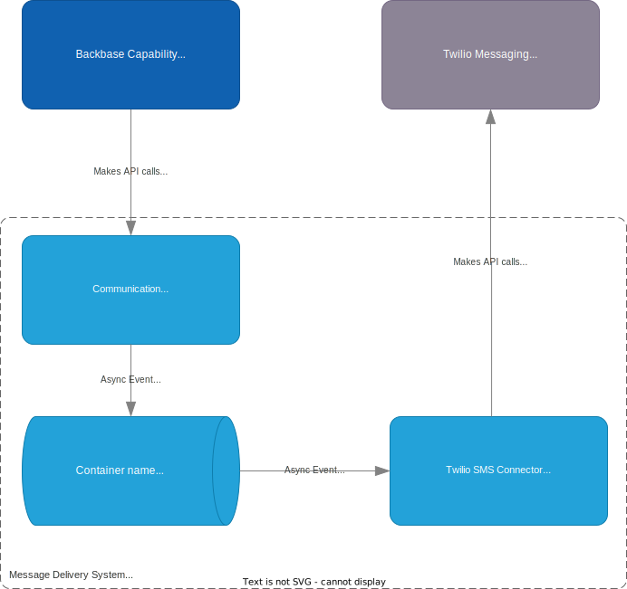

  

This service is used by the <a href="https://community.backbase.com/documentation/foundation_services/latest/message_delivery">Message Delivery</a> capability, and provides integration to Twilio SMS for sending SMS.

 
    
    
    
    

---

## Table of contents
* [About](#about)
* [Usage](#usage)
* [Contributing](#contributing)
* [License](#license)

## About

The `twilio-sms-connector` adds support for sending sms using [Twilio Messaging](https://www.twilio.com/messaging) it is used within the [Message Delivery](https://community.backbase.com/documentation/foundation_services/latest/message_delivery) capability.
In the below diagram you can see how it fits into the Backbase architecture.

This connector was created using the following guide [Build a custom channel](https://community.backbase.com/documentation/foundation_services/latest/build_custom_channel). We use the `communication-channel` building block as a baseline and implement the connector to support the `sms` channel specification.

## Usage
This service is deployed like any other Backbase capability/service and ships with a Docker image and Helm chart.

The following properties **must** be set as they have no default:

Property | Description
--- | ---
**twilio.accountSid** | Account ID created in Twilio
**twilio.authToken** | Authorization token for Twilio account
**twilio.fromNumber** | Number shown as the sender of a SMS

## Contributing

First off, thanks for taking the time to contribute! Contributions are what makes the open-source community such an amazing place to learn, inspire, and create. Any contributions you make will benefit everybody else and are **greatly appreciated**.

Please adhere to this project's [code of conduct](CODE_OF_CONDUCT.md). For detailed instructions on repo organization, linting, testing, and other
steps see our [contributing guidelines](CONTRIBUTING.md)

#### Contributors

## License

This project is licensed under the **Backbase** license.

See [LICENSE.md](LICENSE.md) for more information.